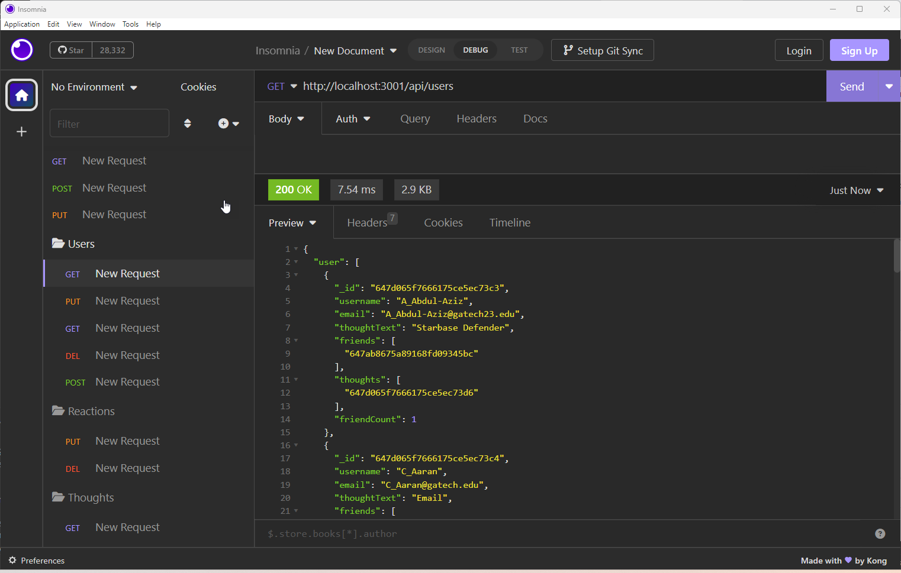
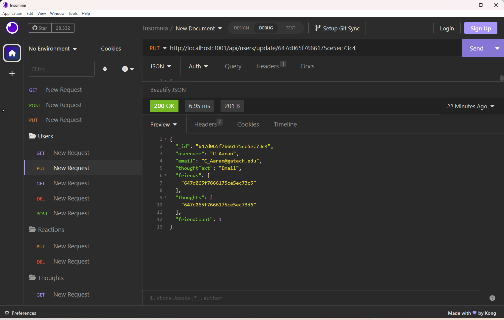
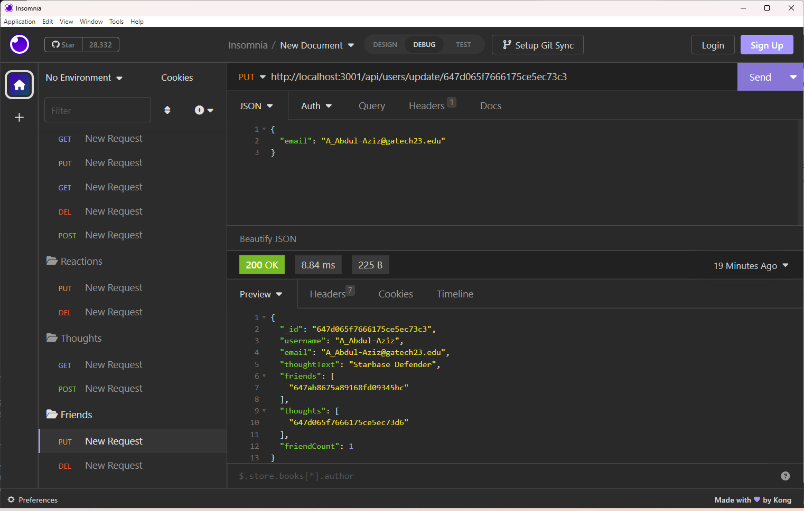
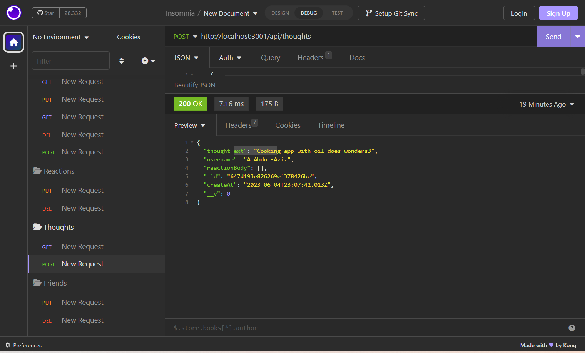

# SocialNetworkAPI
Using MongoDB to build an API for a social network web application
# 18 NoSQL: Social Network API

## My Task

MongoDB is a popular choice for many social networks due to its speed with large amounts of data and flexibility with unstructured data. Over the last part of this course, you’ll use several of the technologies that social networking platforms use in their full-stack applications. Because the foundation of these applications is data, it’s important that I understand how to build and structure the API first.

My Challenge is to build an API for a social network web application where users can share their thoughts, react to friends’ thoughts, and create a friend list. I have use Express.js for routing, a MongoDB database, and the Mongoose ODM. In addition to using the [Express.js](https://www.npmjs.com/package/express) and [Mongoose](https://www.npmjs.com/package/mongoose) packages.

I ensured that the `mongoose` package is using version 6+. The latest version of `mongoose` (version 7+) introduces potential breaking changes to activities. All activities have version `6.9.2` in their respective `package.json` files, and I have install `mongoose`, using `npm i mongoose@6.9.2`.

I created seed data is provided for my Social Network API.

I have created a walkthrough video that demonstrates its functionality and all of the following acceptance criteria being met. 

## Youtube Video
[Social Media API Video](https://youtu.be/HmHTxJouJXw)

## User Story

```md
AS A social media startup
I WANT an API for my social network that uses a NoSQL database
SO THAT my website can handle large amounts of unstructured data
```

## Acceptance Criteria

```md
GIVEN a social network API
WHEN I enter the command to invoke the application
THEN my server is started and the Mongoose models are synced to the MongoDB database
WHEN I open API GET routes in Insomnia for users and thoughts
THEN the data for each of these routes is displayed in a formatted JSON
WHEN I test API POST, PUT, and DELETE routes in Insomnia
THEN I am able to successfully create, update, and delete users and thoughts in my database
WHEN I test API POST and DELETE routes in Insomnia
THEN I am able to successfully create and delete reactions to thoughts and add and remove friends to a user’s friend list
```

## Screen Shots of Projects

Displaying all Users in Insomia



Adding Friends and Thoughts to User in Insomia



Updateing Friend in Insomia




Updating Thoughts in Insomia




